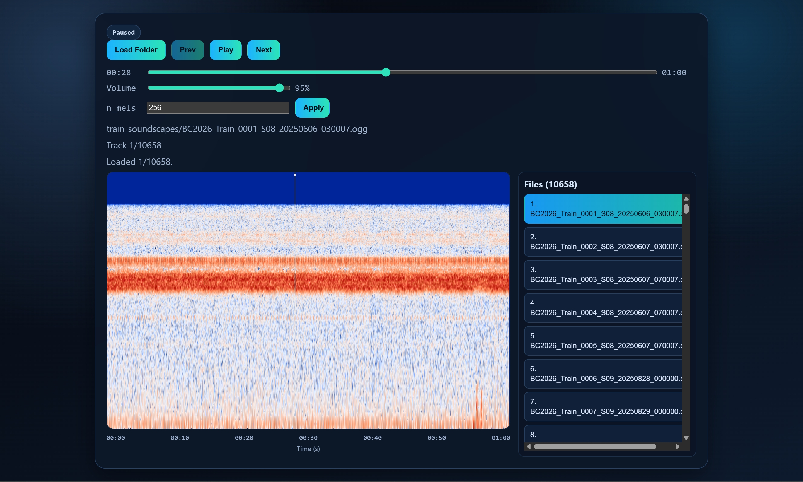

# OGG Spectrum Player

## English

### Overview
OGG Spectrum Player is a desktop audio tool for loading OGG folders, browsing a file list, and viewing a static spectrogram with a draggable playhead.

### Key Features
- Folder-only workflow (`.ogg`, `.oga`)
- Lazy loading for large folders (index first, decode/analyze on selection)
- Static spectrogram generation from full-track analysis
- Normalized color mapping in `[-1, 1]` (high values toward red, low values toward blue)
- Draggable playhead directly on the spectrogram
- Timeline slider seek, volume control, and playlist navigation (`Prev`, `Play/Pause`, `Next`)
- Windows Electron packaging (`.exe`)

### UI Guide (Detailed)

#### 1. Header Area
- `OGG Spectrum Player`: app title.
- `Playing / Paused` status chip: current playback state.

#### 2. Control Bar
- `Load Folder`: opens a folder picker (folder mode).
- `Prev`: loads previous file in playlist.
- `Play / Pause`: toggles playback for current file.
- `Next`: loads next file in playlist.
- `FPS` chip: UI render loop indicator.

#### 3. Timeline Row
- Left label: current playback time (`mm:ss`).
- Slider: seek by time.
- Right label: total track duration (`mm:ss`).

#### 4. Volume Row
- `Volume` slider from `0` to `1`.
- Right label shows percentage (`0% - 100%`).

#### 5. Status Text Block
- Selected file path/name.
- Playlist position (`Track x/y`).
- Action status text (indexing, decoding, analyzing, loaded, playing, errors).

#### 6. Spectrogram Panel
- Static heatmap rendered from full audio analysis.
- Vertical playhead line shows current playback position.
- Drag or click on the spectrogram to seek instantly.

#### 7. X-Axis
- Time ticks below spectrogram.
- `Time (s)` axis label for time reference.

#### 8. Files Panel (Right)
- Scrollable list of indexed OGG files.
- Click any item to load that track.
- Active track is highlighted.

### Folder Loading Behavior
- On folder selection:
  - App indexes matching files and builds list.
  - App does not decode all files immediately.
- On file selection from list:
  - App decodes only that file.
  - App computes spectrogram for that file.

### Tech Stack
- Electron
- React + TypeScript
- Zustand
- Vite
- Web Audio API
- Canvas

### Project Structure
```text
.
|- electron/
|  `- main.ts
|- src/
|  |- App.tsx
|  |- main.tsx
|  |- styles.css
|  |- audio/engine.ts
|  |- store/playerStore.ts
|  `- visualizer/spectrogram.ts
|- docs/heatmap-screenshot.png
|- index.html
|- package.json
`- vite.config.ts
```

### Screenshot


### Development
```bash
npm install
npm run start
```

### Build
```bash
npm run build
```

### Run Desktop
```bash
npm run electron
```

### Package EXE (Windows)
```bash
npm run build
npx electron-builder --win --x64
```

### Notes
- Node 20 LTS is recommended.
- Large tracks may take extra time during spectrogram analysis.

---

## 中文

### 概述
OGG Spectrum Player 是一个桌面端 OGG 音频工具，支持按文件夹加载、文件列表浏览，以及静态热力图频谱显示，并可通过拖拽播放线进行定位。

### 核心功能
- 仅文件夹加载（支持 `.ogg`、`.oga`）
- 大文件夹懒加载（先索引，点选后再解码与分析）
- 基于整首音频离线分析的静态频谱图
- 归一化配色区间 `[-1, 1]`（靠近 `1` 更红，靠近 `-1` 更蓝）
- 频谱图内拖拽播放线定位
- 时间轴拖动、音量控制、播放列表控制（`Prev`、`Play/Pause`、`Next`）
- 支持打包 Windows Electron 安装程序（`.exe`）

### 界面功能说明（详细）

#### 1. 顶部区
- `OGG Spectrum Player`：应用标题。
- `Playing / Paused` 状态标签：当前播放状态。

#### 2. 控制区
- `Load Folder`：打开文件夹选择器（文件夹模式）。
- `Prev`：切到上一首。
- `Play / Pause`：播放或暂停当前文件。
- `Next`：切到下一首。
- `FPS` 标签：界面渲染帧率指示。

#### 3. 时间轴行
- 左侧：当前播放时间（`mm:ss`）。
- 中间滑杆：按时间拖动定位。
- 右侧：当前曲目总时长（`mm:ss`）。

#### 4. 音量行
- `Volume` 滑杆范围 `0` 到 `1`。
- 右侧显示百分比（`0% - 100%`）。

#### 5. 状态文本区
- 当前文件路径/文件名。
- 播放列表位置（`Track x/y`）。
- 状态信息（索引中、解码中、分析中、已加载、播放中、错误提示）。

#### 6. 热力图频谱区
- 由整段音频分析得到的静态热力图。
- 竖线表示当前播放位置。
- 在图上点击/拖拽可直接跳转时间。

#### 7. X 轴
- 热力图下方显示时间刻度。
- `Time (s)` 表示时间轴单位。

#### 8. 文件列表区（右侧）
- 可滚动显示文件夹内 OGG 列表。
- 点击任意文件即可加载该曲目。
- 当前曲目会高亮显示。

### 文件夹加载逻辑
- 选择文件夹后：
  - 仅索引符合条件的文件并生成列表。
  - 不会立刻解码全部文件。
- 在列表中点击某个文件后：
  - 只解码该文件。
  - 只分析该文件并生成热力图。

### 技术栈
- Electron
- React + TypeScript
- Zustand
- Vite
- Web Audio API
- Canvas

### 项目结构
```text
.
|- electron/
|  `- main.ts
|- src/
|  |- App.tsx
|  |- main.tsx
|  |- styles.css
|  |- audio/engine.ts
|  |- store/playerStore.ts
|  `- visualizer/spectrogram.ts
|- docs/heatmap-screenshot.png
|- index.html
|- package.json
`- vite.config.ts
```

### 截图


### 开发运行
```bash
npm install
npm run start
```

### 构建
```bash
npm run build
```

### 桌面运行
```bash
npm run electron
```

### 打包 EXE（Windows）
```bash
npm run build
npx electron-builder --win --x64
```

### 说明
- 建议使用 Node 20 LTS。
- 大音频文件在首次热力图分析时会有等待时间。
